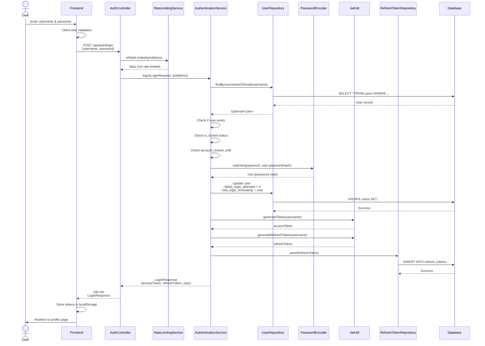
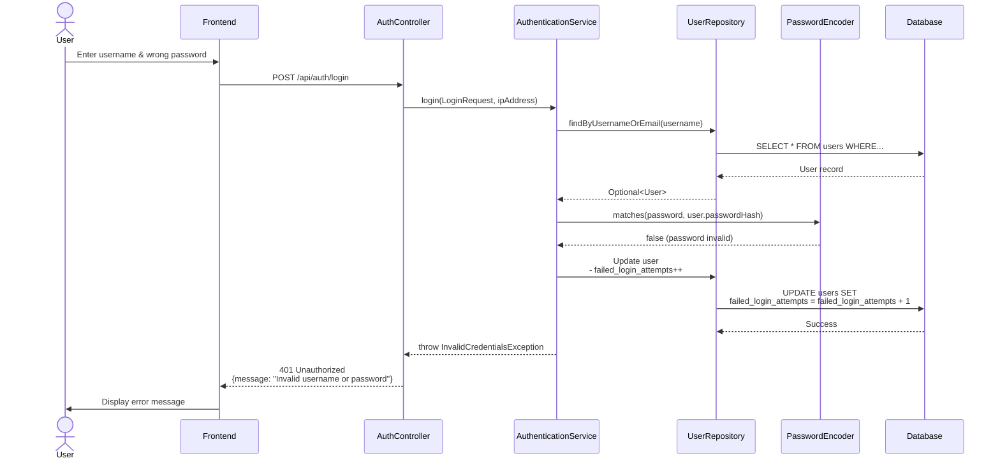
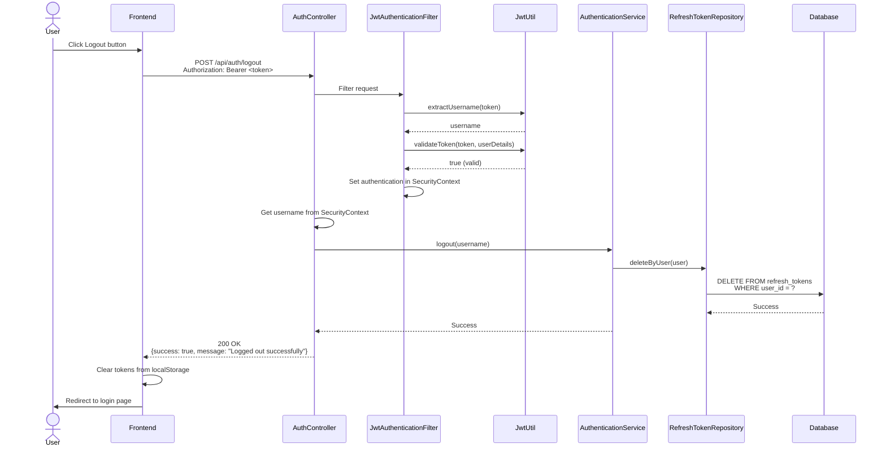
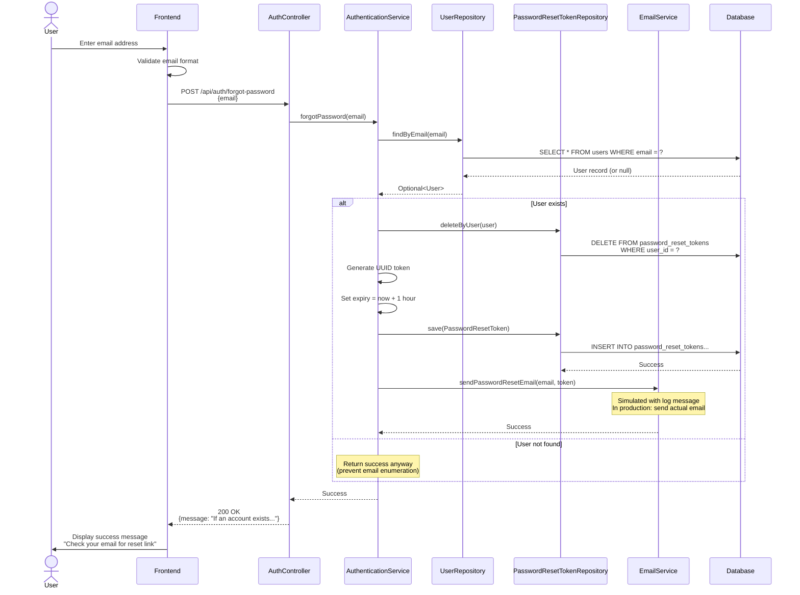
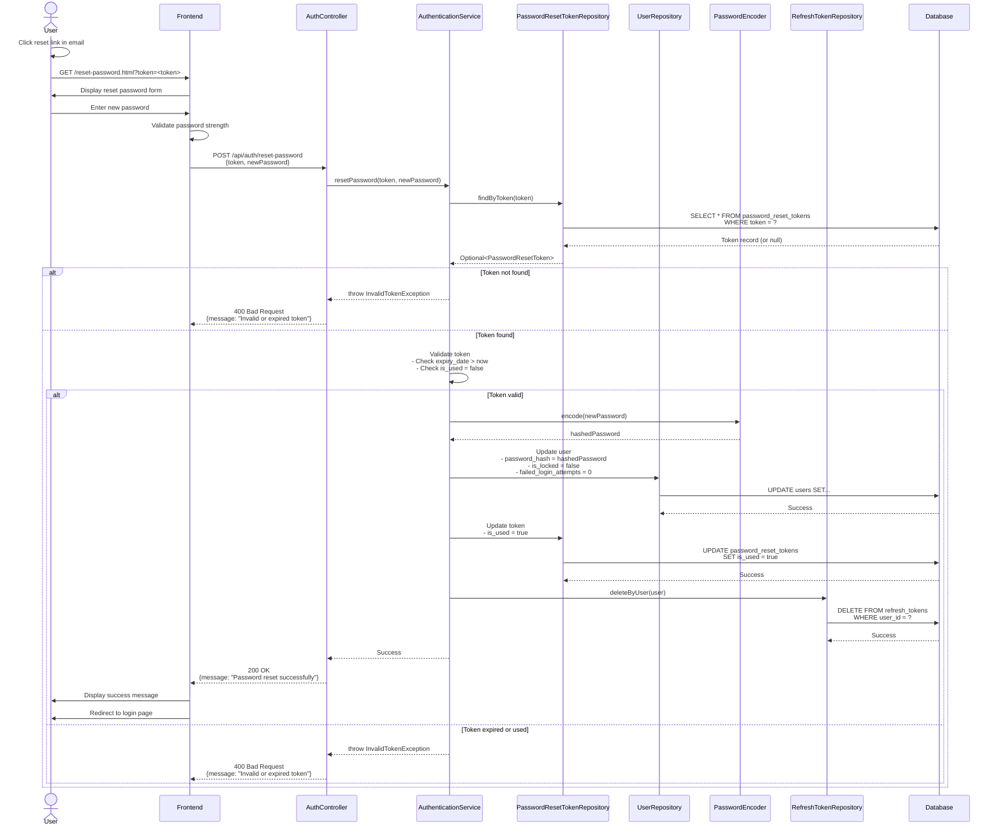
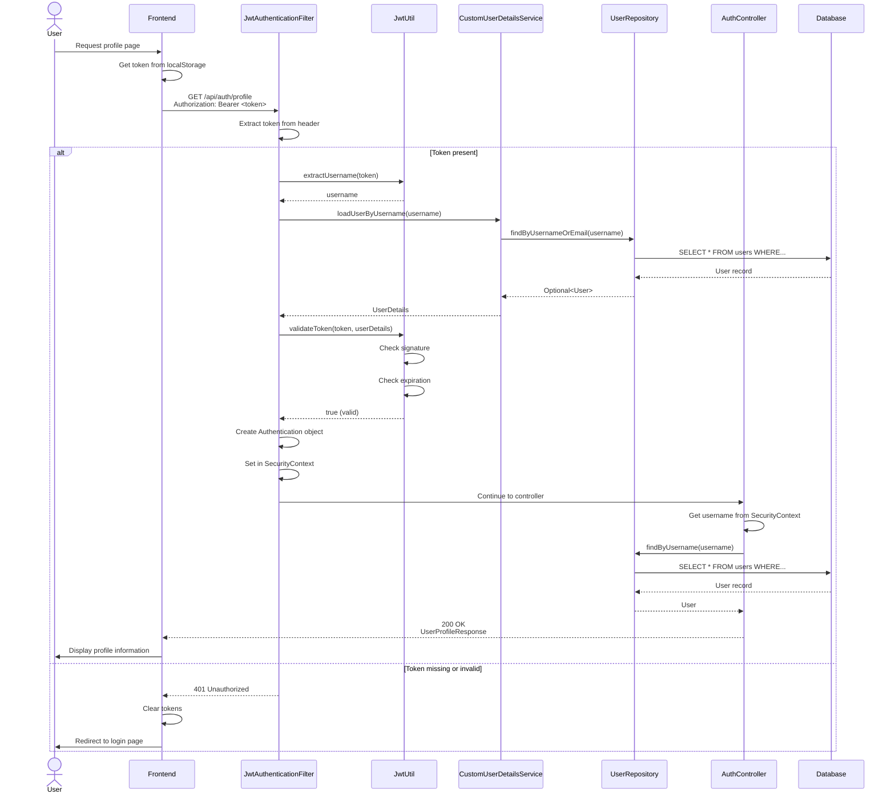
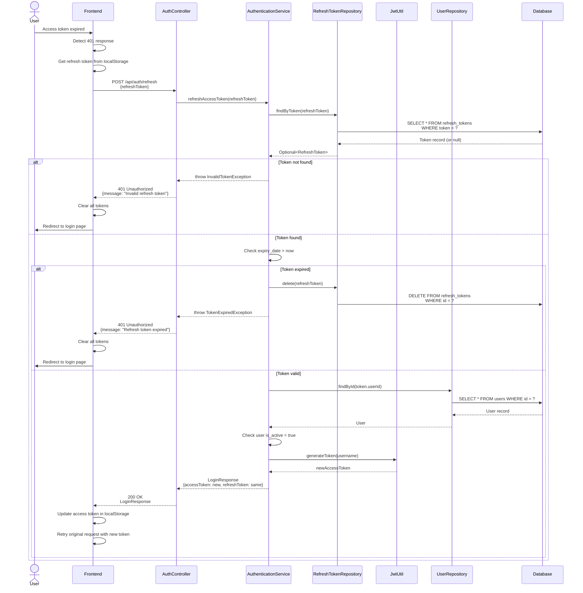
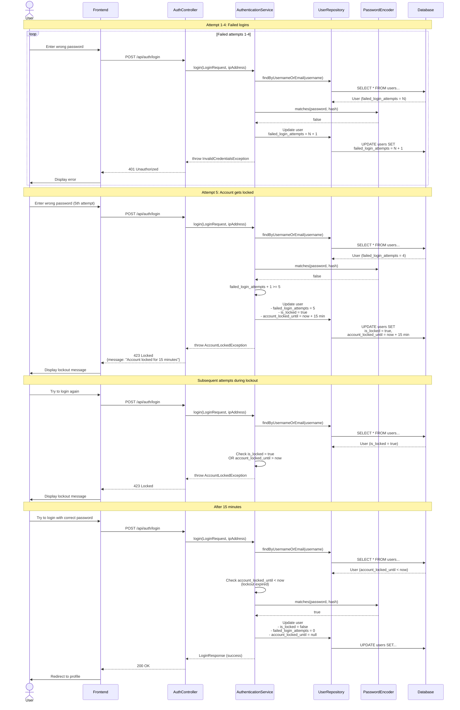
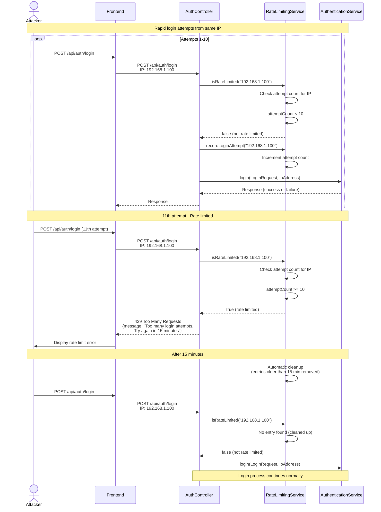

# Sequence Diagrams - Secure User Authentication System

This document contains detailed sequence diagrams for all major authentication flows in the system.

## Table of Contents
1. [Login Flow](#1-login-flow)
2. [Logout Flow](#2-logout-flow)
3. [Forgot Password Flow](#3-forgot-password-flow)
4. [Reset Password Flow](#4-reset-password-flow)
5. [Access Protected Resource Flow](#5-access-protected-resource-flow)
6. [Token Refresh Flow](#6-token-refresh-flow)
7. [Account Lockout Flow](#7-account-lockout-flow)
8. [Rate Limiting Flow](#8-rate-limiting-flow)

---

## 1. Login Flow

### Successful Login

### Failed Login (Invalid Credentials)

---

## 2. Logout Flow

---

## 3. Forgot Password Flow

---

## 4. Reset Password Flow

---

## 5. Access Protected Resource Flow

---

## 6. Token Refresh Flow

---

## 7. Account Lockout Flow

---

## 8. Rate Limiting Flow

---

## Diagram Rendering

These diagrams are written in Mermaid syntax and can be rendered using:

1. **GitHub/GitLab**: Automatically renders Mermaid diagrams in markdown
2. **VS Code**: Install "Markdown Preview Mermaid Support" extension
3. **Online**: https://mermaid.live/
4. **Documentation Sites**: MkDocs, Docusaurus, etc.

## Key Takeaways

### Security Features Illustrated

1. **Multi-layer Validation**: Every request goes through multiple validation steps
2. **Rate Limiting**: IP-based protection against brute force attacks
3. **Account Lockout**: Automatic lockout after 5 failed attempts
4. **Token Management**: Secure generation, validation, and invalidation
5. **Password Security**: BCrypt hashing, never stored in plain text
6. **Stateless Authentication**: JWT tokens contain all necessary information

### Error Handling

All flows include comprehensive error handling:
- Invalid credentials (401)
- Account locked (423)
- Rate limited (429)
- Token expired (401)
- Invalid token (400)
- Server errors (500)

### Performance Considerations

- Database queries optimized with indexes
- In-memory caching for rate limiting
- Stateless design for horizontal scaling
- Efficient token validation

---

**Last Updated:** January 2024  
**Version:** 1.0.0  
**Format:** Mermaid Sequence Diagrams

